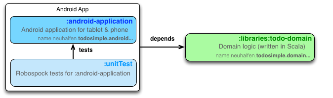
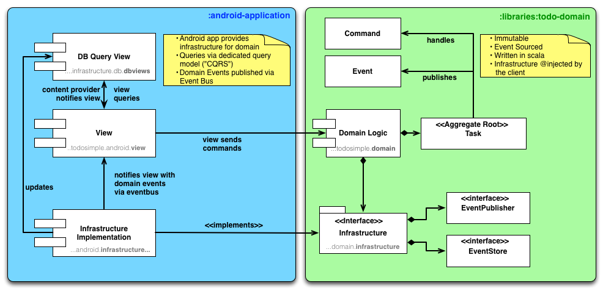

android-simpletodo
==================

[](https://travis-ci.org/neuhalje/android-simpletodo)

TODO app for android (AKA learning android and learning scala).

Gradle project structure
===========================




Architecture
==============




Validation
-----------

No validation yet.

Dependency Injection
--------------------

Domain, and android app use `@Inject` to mark injectable objects. The DI implementation used in the app is [Dagger](http://square.github.io/dagger/). The DI implementation used by the domain tests (scala) is [Guice](https://code.google.com/p/google-guice/), as Dagger won't work with scala.

Views
------

Views are implemented with [flow](https://github.com/square/flow), and [mortar](https://github.com/square/mortar). Squareup has a nice [introduction](http://corner.squareup.com/2014/01/mortar-and-flow.html).

There are no Fragments!

Communication
----------------

### Commands
Views send commands to the domain.

### Queries
Views query the ContentProvider abstraction.

### Events
* The content provider publishes some events (e.g. changes to the view table). These are handled by the views themselves.
* The domain (the implementation in the android project) posts events to a global eventbus

Releases
===========
- currently undecided on how to release.

Branching & Feature Developement
---------------------

Is done via [gitflow](http://nvie.com/posts/a-successful-git-branching-model/). Also look [here](http://danielkummer.github.io/git-flow-cheatsheet/) for a nice cheat sheet.
                           
                           
CAVEATS
=========

Build errors for [unitTest](./unitTest)
----------------------------------------

Sometimes the classs in the android project cannot be found (see below). Re-running `./gradlew clean check` often helps.

```text
:unitTest:compileTestJava UP-TO-DATE
:unitTest:compileTestGroovy
startup failed:
.../unitTest/src/test/groovy/name/neuhalfen/todosimple/android/infrastructure/json/EventJsonSerializerImplTest.groovy: 16: unable to resolve class EventJsonSerializer
 @ line 16, column 29.
           EventJsonSerializer sut = new EventJsonSerializerImpl();
```

Running/Debugging `unitTest`
---------------------

Running `unitTest` in IntelliJ fails with `IncompatibleClassChangeException`s. Debugging the gradle task `:unitTest:check` works though (sometimes the task has to run twice):


o

LICENSE
============
Copyright 2014 Jens Neuhalfen

Licensed under the Apache License, Version 2.0 (the "License"); you may not use this file except in compliance with the License. You may obtain a copy of the License at

http://www.apache.org/licenses/LICENSE-2.0

Unless required by applicable law or agreed to in writing, software distributed under the License is distributed on an "AS IS" BASIS, WITHOUT WARRANTIES OR CONDITIONS OF ANY KIND, either express or implied. See the License for the specific language governing permissions and limitations under the License.

